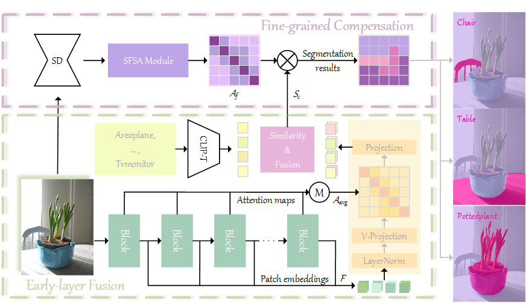

# CLIPer: Hierarchically Improving Spatial Representation of CLIP for Open-Vocabulary Semantic Segmentation

This repo is the official pytorch implementation of the  [CLIPer]()

## Introduction


- We introduce the early-layer fusion, including patch embeddings and attention maps of early layer to the final layer of CLIP for improving spatial representation.
- We further introduce  the fine-grained compensation, utilizing the detailed spacial information in the self-attention maps of Stable Diffusion to obtain the precise segmentation results.
- The proposed CLIPer achieve the state-of-the-art performance on multiple datasets in open-vocabulary semantic segmentation tasks. our proposed CLIPer obtains mIoU scores of 69.8% on VOC and 43.3% on Object when using ViT-L/14 backbone.

For further details, please check out our [paper]().

## Installation
Please follow the code bellow to create the environment
```
conda create -n CLIPer python=3.9
conda activate CLIPer
pip install -r requirement.txt
```
## Data Preparation
Please struct the datasets as follows
```none
datasets
├── ADEchallengeData2016
│   ├── images
│   │   ├── training
│   │   │   ├── ADE_train_00000001.jpg
│   │   ├── validation
│   │   │   ├── ADE_val_00000001.jpg
│   ├── annotations
│   │   ├── training
│   │   │   ├── ADE_train_00000001.png
│   │   ├── validation
│   │   │   ├── ADE_val_00000001.png
├── coco2014
│   ├── train2014
│   │   ├── COCO_train2014_000000000009.jpg
│   ├── val2014
│   │   ├── COCO_val2014_000000000042.jpg
│   ├── coco_seg_anno
│   │   ├── 000000000009.png
├── coco2017
│   ├── train2017
│   │   ├── 000000000009.jpg
│   ├── val2017
│   │   ├── 000000000139.jpg
│   ├── stuff_anno164
│   │   ├── train2017
│   │   │   ├── 000000000009.png
│   │   ├── val2017
│   │   │   ├── 000000000139.png
├── VOCdevkit
│   ├── VOC2010
│   │   ├── JPEGImages
│   │   │   ├── 2007_000027.jpg
│   │   ├── SegmentationClassContext
│   │   │   ├──2008_000002.png
│   ├── VOC2012
│   │   ├── JPEGImages
│   │   │   ├── 2007_000027.jpg
│   │   ├── SegmentationClassAug
│   │   │   ├──2007_000032.png
```
## Evaluation
To evaluate our CLIPer, please enter the scripts folder and run the code
```
# select the config file to evaluate the code
# evaluate voc dataset with background
sh sh_ovs.sh ../scripts/config/vit-l-14/ovs_voc21.yaml
# evaluate voc dataset without background
sh sh_ovs.sh ../scripts/config/vit-l-14/ovs_voc20.yaml
# ...
```
## Results
Run the code in this repo, you should get similar results (reported in paper are shown in the parentheses) in the following table:

| Encoder | VOC  |Context|Object |VOC20 |Contex59 |Stuff |ADE |
|  :----:  |  :----:  |  :----:  |  :----:  |  :----:  |  :----:  |  :----:  |  :----:  |
| ViT-B/16 | 65.9(65.9) |37.6(37.6) | 39.3(39.0) | 85.4(85.2) | 41.7(41.7) | 27.5(27.5) |21.4(21.4) |
| ViT-L/14 | 70.2(69.8) |38.2(38.0) | 43.5(43.3) |  90.0(90.0) | 43.6(43.6) | 29.2(28.7) | 24.4(24.4) |
| ViT-H/14 | 71.0 | 39.7 | 43.2 | 88.9 | 44.3 | 30.7 | 27.5 |

## Visualization


## Citation
TODO